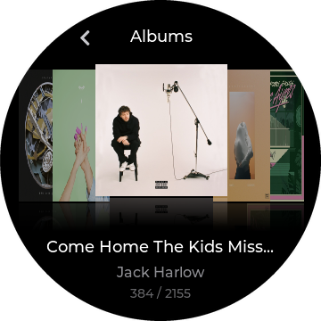
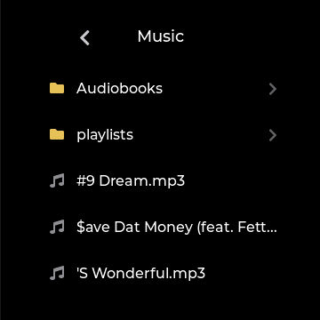
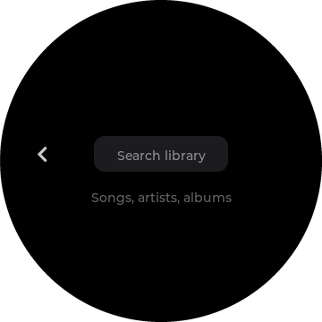
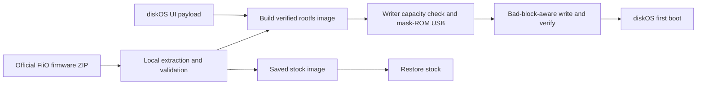

<p align="center">
  
</p>

<h1 align="center">diskOS</h1>

<p align="center">
  A purpose-built player interface for the FiiO Snowsky Disc.<br>
  Designed around the round screen, the music library, and the way the hardware wants to be used.
</p>

<p align="center">
  <a href="#host-support"></a>
  <a href="#whats-proven-vs-beta"></a>
  <a href="LICENSE"></a>
  <a href="https://ko-fi.com/b0hemia"></a>
</p>

<p align="center">
  <a href="#see-diskos">Screenshots</a> |
  <a href="#install">Install</a> |
  <a href="#restore-stock--recover">Restore</a> |
  <a href="#known-issues">Known issues</a> |
  <a href="#documentation">Docs</a> |
  <a href="#contributing">Contribute</a>
</p>

> [!CAUTION]
> **diskOS is an unsupported beta and installation rewrites the Disc's main root filesystem.**
> Power loss, host sleep, a bad cable, a defect, an unsupported device, or an interrupted flash can
> make the player unbootable, lose data, require hardware recovery, or void its warranty. Recovery
> worked on tested units, but is **not guaranteed**. Back up your data and keep the saved stock image
> on separate storage before installing.

diskOS is a custom player UI/firmware for the **FiiO Snowsky Disc** digital audio player
(Ingenic X2000). It replaces the stock interface while keeping the stock audio engine, and uses a
source-run installer to build a diskOS image locally from **your own official FiiO firmware**, then
flashes it over the chip's mask-ROM USB mode. No FiiO root filesystem is distributed by this project.

The installer and build tooling in this repository are open source under the MIT license. The
on-device UI source lives in [`ui/`](ui/) and is licensed separately under **GPL-3.0-or-later** (its built
artifact, `payload/mq_ui`, is what the installer bakes into the image); see [License](#license) for
the boundary.

**v1.1.1 fixes image builds on the default macOS filesystem** by automatically using a temporary
case-sensitive volume. Device flashing from macOS remains unverified end to end.

This builds on v1.1.0's V2.40 firmware support and refreshed listening interface: album cover flow,
a separate Books view with saved progress, folder browsing, Latin-extended, Greek, and Cyrillic
library text, and safer selection of USER EQ presets changed on the stock player.

## At a glance

| | |
|---|---|
| **Device** | FiiO Snowsky Disc |
| **Current release** | v1.1.1 |
| **Project status** | Beta; field testing is still limited |
| **Released host** | Linux x86-64 |
| **macOS** | Image builds tested on the default filesystem; device flashing remains unverified |
| **Flash-tested stock firmware** | V2.09, V2.28, and V2.40 |
| **Typical flash time** | About 15 minutes, including verification |
| **Return to stock** | Saved-image restore, temporary stock boot, or stock UI as default |

Not affiliated with or endorsed by FiiO, Snowsky, or Ingenic. No warranty or support is promised.

## See diskOS

<table>
  <tr>
    <td align="center"><br><sub>Album cover flow</sub></td>
    <td align="center"><br><sub>Now playing</sub></td>
  </tr>
  <tr>
    <td align="center"><br><sub>Library</sub></td>
    <td align="center"><br><sub>Folder browser</sub></td>
  </tr>
  <tr>
    <td align="center"><br><sub>Home</sub></td>
    <td align="center"><br><sub>Custom EQ</sub></td>
  </tr>
  <tr>
    <td align="center"><br><sub>Search</sub></td>
    <td align="center"><br><sub>Apps</sub></td>
  </tr>
</table>

<p align="center">
  
  <br><sub>Boot animation concept: clockwise from the lower-left, matching the real seek-ring geometry.</sub>
</p>

### Built around the Disc

| For listening | For tinkering |
|---|---|
| Circular UI designed for the round display | Graphical and command-line installer |
| Album cover flow with swipe navigation and reflections | Image built locally from your stock firmware |
| Dedicated Books view for `.m4b` audiobooks with saved progress | V2.09, V2.28, and V2.40 firmware support |
| File/folder browsing to find and play library tracks | Bad-block-aware writer with block verification |
| Bezel scrolling and alphabet navigation | Writer capacity checked before any NAND write |
| M3U playlist import | Saved-stock restore, including older short backups |
| Dynamic colors derived from album art | Opt-in SSH debug mode, off by default |
| Latin-extended, Greek, and Cyrillic library text | On-device UI source under GPL-3.0-or-later |
| Custom EQ that preserves stock-edited USER presets on reselection | Hardware map and reverse-engineering notes |
| Local playback as the well-tested path | Stock UI fallback and restore path |
| Weather and Last.fm integrations *(experimental)* | Installer and build tooling under MIT |

**Album cover flow** turns the album library into a horizontal wall with a centered cover,
angled side covers, and faded reflections. Swipe to browse, tap the center album to play, or
long-press it to open its tracks. Covers and reflections are pre-baked into sprites and cached
in a small moving window, with album lists sized to the library. This is designed to accommodate
thousands of albums without keeping every cover in memory. Albums without cached art show a
placeholder.

**Books** gives single-file `.m4b` audiobooks a dedicated view with saved listening positions.
They are separated from the music library and music queues, including existing library entries
migrated during an upgrade. Open a book to continue listening from its saved progress.

**Files** provides the familiar stock-style route through the microSD card's folder tree.
Browse folders and tap an indexed music file to play it. Playback uses the all-songs queue;
selecting a file does not create a queue for that folder.

**Multilingual library text** uses bundled Noto Sans glyphs for Latin-extended, Greek, and
Cyrillic names, so supported filenames and metadata render instead of missing-character boxes.
This expands text coverage; full interface localization is not included.

**Safer custom EQ** checks the current stock curve against diskOS's saved settings before writing
it back. Reselecting a USER preset preserves changes made on the stock player. Advanced parametric
presets that the graphic editor cannot represent are protected from slider edits.

## Install

> [!IMPORTANT]
> Read [Requirements](#requirements), [What's proven vs. beta](#whats-proven-vs-beta), and
> [Known issues](#known-issues) before connecting the player. Do not run the installer as root.

### First-time setup

Run these commands from the installer directory.

The installer runs with your own **Python 3.8+**. The setup script creates a local virtual
environment and installs two Python dependencies into it; nothing is installed system-wide.

```bash
./install.sh
```

The setup check will tell you if either system component is missing:

- **Tk / tkinter:** needed only by the graphical installer. Debian/Ubuntu:
  `sudo apt install python3-tk`
- **libusb-1.0:** used to detect the device in mask-ROM mode. Debian/Ubuntu:
  `sudo apt install libusb-1.0-0`

After setup, run commands through `./diskos-installer`; it selects the local environment for you.

> [!NOTE]
> A source checkout does not include the large host-native flash tools. Build them once using the
> scripts in [For developers](#for-developers). A prepared release bundle places them under
> `vendor/<os>-<arch>/`.

### Graphical installer

1. Run `./diskos-installer gui`.
2. Choose **Install diskOS**, select your official FiiO firmware `.zip`, then select a variant:
   - **Public** *(recommended):* no always-on root shell. SSH can still be enabled temporarily
     from Debug Mode in the UI.
   - **Dev:** adds a passwordless USB-serial root shell on every boot. Use this only on a dedicated
     development device you control.
3. Power the Disc off. Hold **Volume Down** and plug in USB to enter mask-ROM mode. The screen stays
   black; that is expected.
4. Select **Install**, acknowledge the warning, and begin. Do not disconnect the cable or let the
   host sleep during the roughly 15-minute flash.
5. After verification succeeds, power-cycle the device. diskOS is embedded in the flashed image and
   installs on first boot; no microSD installation step is needed.

### Command line

```bash
./install.sh
./diskos-installer doctor
./diskos-installer install --firmware SNOWSKY_DISC_update_*.zip --variant public
```

Useful recovery and cleanup commands:

```bash
./diskos-installer restore-stock
./diskos-installer remove
```

`restore-stock` acts on the player. `remove` cleans up the installer's files on the host, including
saved recovery files; restore first if needed and keep a separate copy of your saved stock image.

Updating diskOS also requires a flash. Use the complete v1.1.1 installer and its matching flash
tools, supply your official firmware archive, and follow the same installation steps.

## Requirements

- A **FiiO Snowsky Disc** with supported stock firmware.
- The matching official FiiO firmware `.zip`. You supply this file; the installer decrypts and
  extracts its root filesystem locally.
- A reliable USB cable and about 15 uninterrupted minutes.
- **Python 3.8+** and the dependencies installed by `./install.sh`.
- USB access to mask-ROM device `a108:eaef`.
- **Linux x86-64** for the path tested through device flashing. macOS image builds are tested;
  see [Host support](#host-support) for the remaining limitation.

Do **not** run the installer with `sudo`. Its saved recovery image and state belong under your user
account. On Linux, install the included udev rule once instead:

```bash
sudo cp udev/70-diskos-maskrom.rules /etc/udev/rules.d/
sudo udevadm control --reload-rules
sudo udevadm trigger
```

The build, save, and flash then run as one unprivileged process.

### Host support

- **Linux x86-64:** released and tested end to end on hardware with V2.09, V2.28, and V2.40.
- **macOS, Apple Silicon and Intel:** a build-from-source path is available through
  `build/build-macos.sh` after installing libusb with Homebrew. **Image builds now succeed on the
  default case-insensitive macOS filesystem.** The installer automatically creates and mounts a
  case-sensitive APFS scratch image using `hdiutil`, verifies its case sensitivity, and uses it for
  rootfs extraction and validation. It detaches the volume and removes the scratch image
  automatically afterward, reporting cleanup failures if they occur. No manual volume setup or
  `DISKOS_INSTALLER_HOME` change is needed for a normal build.
  **Device flashing from macOS remains unverified end to end:** no flash with a device attached
  to a Mac has been completed.

The macOS fix resolves the E230 `unsquashfs ... already exists` failure caused by stock files whose
names differ only in case. On real macOS, `back_home.png` and `BACK_HOME.png` now coexist in the
extracted filesystem. The scratch-volume mechanism leaves the existing build path unchanged on
Linux with a case-sensitive filesystem and on case-sensitive macOS volumes.

## Restore stock & recover

`restore-stock` reflashes the checksum-verified stock root filesystem reconstructed and saved during
installation. This is built from your official firmware archive, not a dump of the device's original
partition. It deactivates diskOS, but it is not a factory wipe; inactive files under `/usr/data`
remain until you remove them.

Older, shorter saved stock images remain usable: restore creates a copy padded to the current
768-block image size, then validates it before flashing. Keep your saved stock image on separate
storage.

You can also switch without reflashing:

- **Persistently:** Settings > System > Default UI > Stock
- **Once:** hold **Volume Up** during power-on

If a flash fails, the root filesystem can be left partially written. In tested cases, the device
could be returned to mask-ROM mode by powering off, holding **Volume Down**, and reconnecting USB,
then reflashing diskOS or the saved stock image. Mask-ROM lives in on-chip ROM and is entered before
flashed code runs, but recovery is still **not guaranteed** for every unit or failure.

## What's proven vs. beta

| Status | Area | Current evidence |
|---|---|---|
| Tested | Flash mechanism and image build | Used on real hardware; writer skips factory bad blocks and verifies every block |
| Tested | Firmware extraction | Reproduces the stock root filesystem byte for byte from FiiO's archive |
| Tested | Linux x86-64 | Builds and flashes end to end on hardware with V2.09, V2.28, and V2.40 |
| Tested | macOS image builds | Builds succeed on the default case-insensitive filesystem; case-colliding stock files coexist |
| Unverified | macOS device flashing | No end-to-end flash with a device attached to a Mac yet |
| Limited | Firmware coverage | V2.09, V2.28, and V2.40 are flash-tested; other versions are refused by default |

Local music playback is the well-tested listening path. Weather and Last.fm remain experimental;
hardware flash testing does not imply that every feature or mode has been verified.

The Disc uses **Winbond W63AH6NKB LPDDR3**, the DRAM initialized by its stock bootloader. If a future
hardware revision uses different DRAM, the writer is designed to fail at memory initialization and
leave the device mask-ROM-recoverable instead of continuing. Wide field testing is still in progress.

## Known issues

- **Firmware coverage:** only V2.09, V2.28, and V2.40 are currently flash-tested. Other command maps can
  differ and are refused by default.
- **macOS flashing:** image builds are tested, but device flashing from a Mac remains unverified.
- **Long flash:** a complete write and verification takes about 15 minutes. Most of the time is
  a conservative fixed wait; a faster writer is planned.
- **No on-device update path:** updating diskOS currently requires another flash.
- **microSD after cold boot:** the card mounts a few seconds after startup. If the library initially
  appears empty, reinsert the card once.
- **Cover flow artwork:** albums without cached art show placeholders. Playing a track with artwork
  lets diskOS populate its art cache.
- **Folder playback:** a selected file must be in the library database. Unindexed files report
  "Not in library". Playback uses the all-songs queue, not a folder-only queue.
- **Lightly tested modes:** USB DAC, Bluetooth receiver, and USB storage have less coverage than
  local playback.
- **USB-serial debug:** the dev variant's CDC-ACM serial shell can be unreliable. Prefer temporary
  SSH over Wi-Fi.
- **Last.fm:** scrobbling is experimental and has not completed a live end-to-end verification.
  Setup transfers your API key over your local network in plaintext HTTP. It is off by default; read
  [`docs/PRIVACY.md`](docs/PRIVACY.md) first.

Found another issue? Open a GitHub issue and include the device's **firmware version** and the exact
on-screen **error code**.

## How it works



diskOS adds a small hook to the stock `fiio_init.sh` that launches `mq_ui` instead of the stock UI.
The stock root filesystem is read-only squashfs, so enabling the hook requires rewriting partition
`mtd2`. On first boot, the embedded UI is copied to writable storage and checked against a baked
SHA-256 manifest. If validation fails, the stock UI launches instead.

The image uses **768 NAND blocks (96 MiB)** so V2.40's roughly 88 MB stock root filesystem fits.
This capacity was increased from 580 blocks in v1.1.0 without changing the partition layout.
Before any NAND write, the flasher checks that the writer's compiled capacity can cover the image
and refuses an undersized or unrecognized writer. It also checks the reported capacity after the
write, alongside the existing block verification.

The device's normal update menu checks a signature this project cannot create, so installation uses
mask-ROM USB. See [`docs/HARDWARE.md`](docs/HARDWARE.md) for the partition map and hardware details.

## Documentation

| Document | What it covers |
|---|---|
| [`docs/DESIGN_SYSTEM.md`](docs/DESIGN_SYSTEM.md) | Round-screen tokens, edge-ring geometry, components, accessibility, and boot motion |
| [`docs/PREVIEW_UI_BUILD.md`](docs/PREVIEW_UI_BUILD.md) | Preview an `mq_ui` build on the Disc live over Wi-Fi, no reflash (reverts on reboot) |
| [`docs/HARDWARE.md`](docs/HARDWARE.md) | Live-probed SoC, four CS43131 DACs, display planes, power, wireless, USB, and hardware gaps |
| [`docs/COMMAND_MAP.md`](docs/COMMAND_MAP.md) | Roughly 221 `mq_player` IPC tags, reply frames, and MCU/SPI commands |
| [`docs/RE_CATALOGUE.md`](docs/RE_CATALOGUE.md) | Reverse-engineering catalogue for `mq_player` and `mq_ui` |
| [`docs/PRIVACY.md`](docs/PRIVACY.md) | Network behavior of the installer and on-device UI |
| [`build/README-vendor.md`](build/README-vendor.md) | Building and packaging portable native flash tools |
| [`SPL_SOURCE.md`](SPL_SOURCE.md) | GPL source and build recipe for the stage-1 DRAM bring-up loader |
| [`DEPENDENCY_INVENTORY.md`](DEPENDENCY_INVENTORY.md) | Optional one-file bundle dependencies and obligations |
| [`NOTICE.md`](NOTICE.md) / [`licenses/`](licenses/) | Third-party component and license mapping |
| [`SECURITY.md`](SECURITY.md) | Private vulnerability reporting |
| [`CONTRIBUTING.md`](CONTRIBUTING.md) | Safe contribution workflow |
| [`agents/`](agents/) | Project brief for diskOS development |

## For developers

A prepared release bundle includes native host tools under `vendor/<os>-<arch>/`. A fresh source
checkout does not include those large binaries, so build them once.

On Linux:

```bash
bash build/build-usbboot-static.sh
bash build/build-squashfs-static.sh
```

On macOS:

```bash
bash build/build-macos.sh
```

The macOS script also builds a standalone installer. See
[`build/README-vendor.md`](build/README-vendor.md) for native tool and packaging details.

You can optionally create a self-contained binary. This is not the normal release format and
bundles many system libraries; review [`licenses/THIRD_PARTY_BUNDLED.md`](licenses/THIRD_PARTY_BUNDLED.md)
before redistributing it.

```bash
bash build/build.sh
```

### Building the UI

The on-device UI source is in [`ui/`](ui/), licensed **GPL-3.0-or-later** - fork it, theme it, make
it yours. LVGL 9.2.2 is vendored in `ui/lvgl/` (lightly customized), so all you need is a static
`mipsel-linux-musl` toolchain; see [`ui/README.md`](ui/README.md) for the full recipe.

```bash
cd ui && make    # toolchain as mipsel-linux-musl-gcc; or: make CROSS=/path/to/mipsel-linux-musl-
```

## Debug Mode

<details>
<summary><strong>Optional SSH access and security notes</strong></summary>

Debug Mode is **off by default**. Open **Settings > System > Debug Mode > Enable Debug** to show an
SSH command and a newly generated password. The password rotates each time Debug Mode is enabled.

While enabled, the password is stored in plaintext at `/usr/data/sshd/current_pw` with mode `0600`
so the UI can display it again after a restart. Disabling Debug Mode removes the file. A reboot can
leave a stale copy, but the SSH overlay is inactive until Debug Mode is enabled again.

Debug Mode uses Dropbear 2022.83, which predates the CVE-2023-48795 Terrapin Strict-KEX mitigation.
Use it only for short sessions on a trusted network and turn it off when finished.

</details>

## Error codes

<details>
<summary><strong>Installer and device error reference</strong></summary>

Quote the complete code in bug reports. A stopped flash can leave the root filesystem partially
written even when the writer fails closed.

| Code | Meaning |
|---|---|
| **E1xx** | Environment or preflight; nothing was written |
| E101-E103 | Unsupported host, missing component, or tool cannot run |
| E110-E112 | Mask-ROM device detection or permission problem |
| E120-E122 | Image missing, wrong size, or not a squashfs |
| E123 / E124 | Writer capacity cannot be verified or is too small; refused before any NAND write |
| E140-E142 | Firmware ZIP, saved stock image, or state-directory problem |
| **E2xx** | Firmware extraction and image build |
| E201-E224 | Unsafe archive, OTA manifest, decrypt, rootfs, version, payload, or hash problem |
| E230-E250 | Squashfs extraction/build, size, validation, filesystem, symlink, partition, or variant problem |
| E234 | Build filesystem could not be verified as case-sensitive, or scratch-volume setup failed; see the accompanying message |
| **E3xx** | Host-side flashing |
| E301 / E302 | Missing or truncated result; outcome unknown |
| E303 | Flash timed out |
| E310 | Device reported a verification failure |
| E311 | Writer capacity reported after flashing does not match the image; treat the flash as failed |
| **F1xx** | Device writer aborted; return to mask-ROM and reflash or restore |

Process exit codes are `0` success, `1` error, `2` usage or preflight refusal, `3` cancelled, and
`130` interrupted.

</details>

## Contributing

Bug reports, hardware findings, documentation fixes, and carefully scoped patches are welcome.
Read [`CONTRIBUTING.md`](CONTRIBUTING.md) before changing flashing code or security-sensitive paths.
Report vulnerabilities privately according to [`SECURITY.md`](SECURITY.md).

## Acknowledgements

Thanks to the people who contributed reports, tools, and fixes:

- **[eudj1n](https://github.com/eudj1n)** reported the V2.40 image-size issue
  ([#1](https://github.com/b0hemia/diskos/issues/1)) with a byte-exact stock rootfs reproduction,
  reported the Cyrillic rendering issue ([#3](https://github.com/b0hemia/diskos/issues/3)),
  and built a QEMU preview harness.
- **Pierre Nel ([@pierrenel](https://github.com/pierrenel))** contributed the macOS
  case-insensitive-filesystem fix ([PR #2](https://github.com/b0hemia/diskos/pull/2)).
- **[zmd22](https://github.com/zmd22)** corrected the V2.40 `0657` work-mode command table from
  hardware testing ([discussion #6](https://github.com/b0hemia/diskos/discussions/6)) and shared
  UI customizations ([discussion #5](https://github.com/b0hemia/diskos/discussions/5)).

## Support the project

diskOS is an open-source hobby project maintained by b0hemia, with community contributions.
Tips are optional, but they help keep testing, reverse-engineering, documentation, and release
work moving.

<p align="center">
  <a href="https://ko-fi.com/b0hemia">
    
  </a>
</p>

## License

- Original installer code, scripts, and documentation are **MIT** licensed; see [`LICENSE`](LICENSE).
- Third-party components keep their own licenses. GPL/LGPL corresponding source, notices, and
  relinking information are included in [`corresponding-source/`](corresponding-source/),
  [`spl-src/`](spl-src/), [`SPL_SOURCE.md`](SPL_SOURCE.md), [`NOTICE.md`](NOTICE.md), and
  [`licenses/`](licenses/).
- The on-device UI **source** is in [`ui/`](ui/), licensed **GPL-3.0-or-later**
  (see [`ui/COPYING`](ui/COPYING)) - deliberately copyleft so forks stay open. Its built artifact
  ships at `payload/mq_ui`. The UI's bundled components (LVGL, SQLite, fonts) keep their own
  licenses; see [`ui/README.md`](ui/README.md).

> [!WARNING]
> Do not redistribute generated `diskos_*.bin` images. They contain FiiO's root filesystem. Build
> them locally from firmware you obtained from FiiO and share the installer, not the resulting image.
